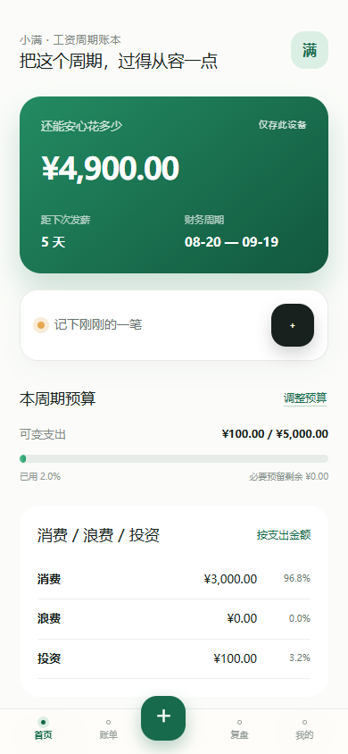

# Sprint 1 交付说明 / Delivery Summary

## 中文

### 这次交付的是什么

**Sprint 1 指第一轮开发迭代，不是需求文档。** 需求文档是 PRD，说明“要做什么”；本次开发已经做出了可以运行的工资周期记账功能；PR 是汇总代码、测试和说明的变更包，当前尚未合并或正式发布。

### 已实现的功能

- 设置发薪日、本周期可用收入、计划储蓄、必要支出预留。
- 首页优先显示“还能安心花多少”，并显示剩余天数、预算、消费性质和最近账目。
- 手动添加、编辑和删除账目；由用户确认消费 / 浪费 / 投资。
- 保存后自动重算；支持零收入、负余额、旧备份恢复、导出和首次加载后的离线使用。
- 计算用确定性代码完成；AI 不可用时仍能完整手动记账。

### 已确认的三项规则

1. 每月29–31日发薪遇短月时，使用当月最后一天。
2. 可用收入以预算中的确认为准；收入账目仅作记录，避免工资重复计入。
3. 可变支出扣减安心可花；使用必要预留的支出不重复扣减。

### 谁负责审核

**AI 负责技术审核：** 代码、计算、数据保存、测试和缺陷修复。您不需要读懂研发文件。

**您负责产品判断：** 信息是否清楚、记账是否顺手、功能是否解决您的问题，以及后续优先级和关键业务规则。

本次已额外完成独立代码复核，发现并修复4项问题；详情见[技术复核报告（中英）](SPRINT_1_REVIEW.md)。验证包括34项自动测试、7项浏览器验收、两种构建、类型和代码检查。GitHub 检查的最终状态以实现 PR 为准。

### 可选体验示例——无需审核代码

收入10,000元，储蓄2,000元，必要预留3,000元，初始安心可花为 **5,000元**。记录100元可变支出后为 **4,900元**；删除该笔后恢复 **5,000元**。记录工资收入不会重复增加余额；记录使用预留的房租不会再次扣减安心可花。

### 当前边界

真实AI模型、完整AI评测、Beta云存储和权限验证尚未完成。退款、信用卡、预留超额自动拆分、提醒阈值和健康评分仍需后续产品决策。原有依赖的23项安全公告需在服务器/Beta发布前专项处理。浏览器数据清理或设备丢失仍依赖事先导出的备份。

更多研发细节在下方英文说明和[审计记录](SPRINT_1_AUDIT.md)中，由AI审核，供需要时追溯。

---

# English — Sprint 1 implementation and acceptance

## What changed

Starting from `factory/dev-ready-v0.1`, the existing local ledger now implements salary-cycle planning → manual bookkeeping → deterministic safe-to-spend → budget/nature/recent-transaction feedback. Home answers “还能安心花多少” first. Navigation is 首页 / 账单 / + / 复盘 / 我的.

Audit: [SPRINT_1_AUDIT.md](SPRINT_1_AUDIT.md). Approved rules and engineering choices: [DECISIONS.md](DECISIONS.md#d-013--alpha-salary-and-spending-semantics).

## Architecture

`app/` presents forms and state. `lib/domain/` owns financial types, calendar rules and integer-fen calculations. `lib/data/repository.ts` validates commands and defines durable persistence boundaries. `local-adapter.ts` retains the original IndexedDB identity, migrates v1 backups, and isolates the fallback. Supabase and Drizzle remain disconnected from the Alpha flow.

UI success means the storage transaction completed. Failures preserve inputs; read errors never trigger a default-state overwrite. Revision checks protect against concurrent tabs. JSON export includes cycles, budgets and final subjective values; CSV remains available. Imported unknown expense allocations require confirmation before an affected safe-to-spend headline appears.

The vinext build no longer requires absent `.openai/hosting.json`; the Sites plugin is enabled only when hosting metadata exists. The GitHub Pages build is preserved. The Pages service worker caches the static shell and fingerprinted assets so the ledger can reopen offline after initial online loading; it does not cache API responses or financial records.

## Product Owner acceptance — about 3 minutes

1. Set payday 20, income ¥10,000, savings ¥2,000 and reserve ¥3,000. The initial safe-to-spend is **¥5,000**.
2. Add a ¥100 variable expense, choose category and 消费 / 浪费 / 投资: **¥4,900**. Edit to ¥200: **¥4,800**. Delete: **¥5,000**.
3. Record salary income ¥10,000: the headline stays **¥5,000**. Record ¥3,000 rent using necessary reserve: still **¥5,000**, remaining reserve **¥0**.
4. Change confirmed income to ¥11,000 in the budget: **¥6,000**. Refresh and verify values/nature survive.
5. Export a JSON backup; restore it through data settings or the first-run form. Verify cycles and records are retained.

Negative results remain visible; zero-income and zero-savings plans are supported. A cycle ending does not invent a salary deposit or silently carry a budget forward.

## Validation

- `npm test`: vinext build, 32 domain/repository/classification/AI tests, and 2 server-render/integration assertions.
- `npm run typecheck` and `npm run lint`.
- `npm run build:github`.
- `npm run test:browser`: Chromium/Chrome acceptance tests for CRUD, nature, exact money, income deduplication, reserves, budget edits, portable backup/restore, offline reload, legacy confirmation, stale tabs, zero/negative values, rollover failed durable writes and offline upgrades. Local Windows uses `PLAYWRIGHT_CHANNEL=chrome`; CI installs Chromium.
- `npm run eval`: disabled provider yields 0 evaluated / 3 skipped. `npm run eval -- --fixture-provider`: 3 smoke fixtures; validates harness plumbing only.
- PR CI runs both builds, tests, typecheck, lint and browser acceptance; screenshots and traces are uploaded as artifacts.

## Known gaps / next decisions

1. **Before Beta:** Supabase Auth + PostgreSQL + verified RLS, cloud migration, account export/delete, and a dependency upgrade/retest pass. Alpha does not call the existing cloud client.
2. **AI:** real Dify provider, model/cost/privacy decision, full ~290 labeled cases, real baseline and human review rubric remain. See [AI_EVAL_NOTES.md](AI_EVAL_NOTES.md).
3. **Product rules still open:** refunds, credit/committed spending, automatic treatment of temporary income, reserve-overflow splitting, feedback thresholds, health-score weights, daily briefs and personalized nature references. The sprint implements no invented financial health scores, investment recommendations or strong L3 threshold.
4. **History:** old cycles/records are retained and bill filters can find them; rich historical-cycle review and arbitrary backdated cycle creation are future work. Legacy records outside established cycles remain visible/exportable but need a cycle before fully assigning them.
5. **Local durability:** browser clearing/device loss still requires a prior backup. Corrupt persisted data is retained and read errors block writes; there is not yet a dedicated corrupt-file repair UI. Fallback localStorage mode requires Web Locks to avoid unsafe cross-tab writes.
6. **Dependency baseline:** `npm audit` reports 23 advisories (16 high / 6 moderate / 1 low), unchanged from initial install. Direct affected packages include Vite, vinext, react-server-dom-webpack, Cloudflare tooling and drizzle-kit. The server-function advisory matters before any server deployment. No forced or broad dependency upgrades were mixed into this sprint.

## Screenshots

Synthetic test values only.

